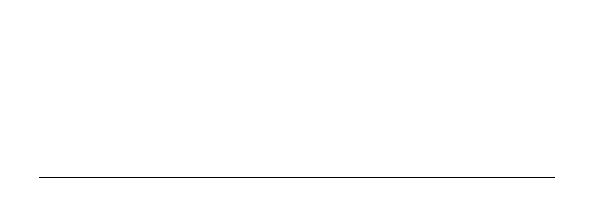

# Credit Fraud Classifier

> **A machine learning project that detects fraudulent credit card transactions using Logistic Regression and Random Forest, tracked with MLflow for full experiment reproducibility.**

---

## Overview

Credit card fraud costs financial institutions and consumers billions of dollars annually. This project builds and compares two classification models to detect fraudulent transactions, documenting the full ML lifecycle: from data exploration and feature engineering to model evaluation and experiment tracking.

My original plan wasn't to use the most popular dataset available because the variables are confidential, which made the EDA analysis more complicated. My actual goal with this project was to practice data analysis to perform effective preprocessing, but I later discovered that the dataset I chose was synthetically generated, which made it difficult to improve the predictions. So, I ended up using the most popular dataset to validate the model's performance on real data.

## Project Documentation

* [ML Design Document](./docs/ML_DESIGN.md): Problem statement, data dictionary, feature engineering plan, model selection, and evaluation metrics.

---

## Key Findings



Random Forest outperformed Logistic Regression across all metrics, confirming the initial hypothesis that non-linear relationships in transaction data benefit from ensemble methods.

**Note:** These metrics were extracted from the model thanks to MLflow experiments tracking, and the comparison is between the Random Forest model trained on each dataset. The best performance comes from the ULB credit card fraud dataset.

## Tech Stack

* **Python** — primary language
* **Pandas** — data manipulation and EDA
* **Matplotlib & Seaborn** — data visualization
* **Scikit-learn** — model training, preprocessing (RobustScaler), and evaluation
* **MLflow** — experiment tracking and model comparison

## Datasets

### ULB Credit Card Fraud Detection (Primary)
* **Source:** Kaggle
* **Size:** 284,807 transactions  
* **Imbalance:** 0.17% fraudulent transactions

### Synthetic Dataset (Exploratory)
* **Source:** Kaggle — bhadramohit/credit-card-fraud-detection
* **Size:** 100,000 transactions
* **Note:** Discarded after EDA revealed uniform distributions inconsistent with real transaction behavior resulting in inconsistent and unreliable predictions.

## Quick Start

```bash
git clone https://github.com/miguelvelezsk/credit-fraud-classifier
cd credit-fraud-classifier
python3 -m venv venv
source venv/bin/activate
pip install -r requirements.txt
jupyter notebook
```

To view MLflow experiments:
```bash
mlflow ui
```
Then open `http://localhost:5000`

---

## Author

**Miguelangel Velez Aguirre**
* Systems Engineering Student at Universidad de Antioquia (UdeA)
* [LinkedIn](https://www.linkedin.com/in/miguelangel-vélez-aguirre-235982168/) | [GitHub](https://github.com/miguelvelezsk)